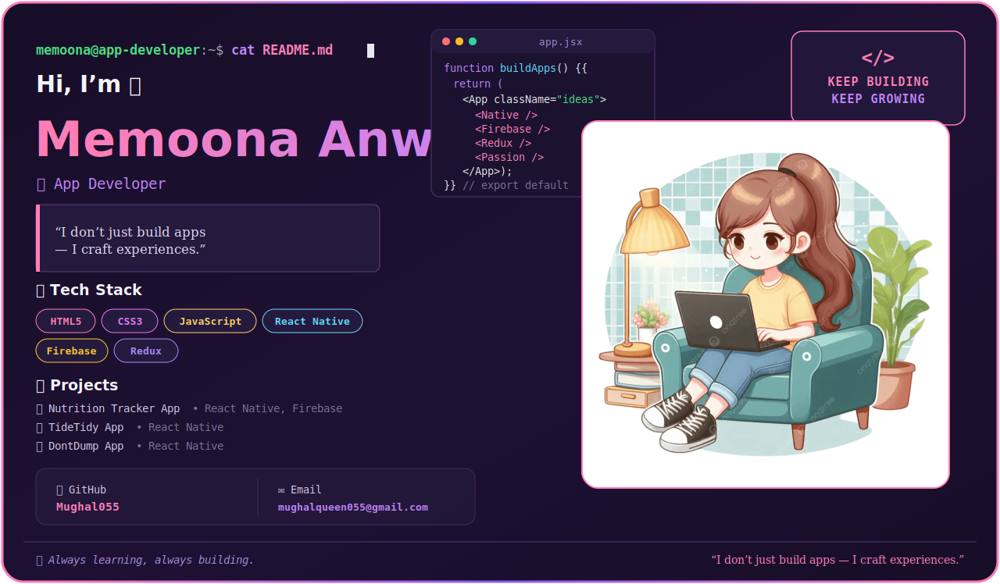
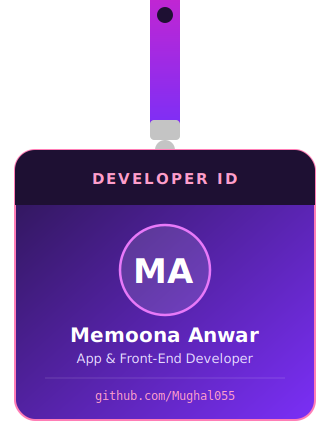

<!-- ✨ Banner ✨ -->

 

<table align="center" border="0">
<tr>
<td width="38%" align="center" valign="middle">

<!-- 🪪 Swinging Lanyard ID Card -->

</td>
<td width="62%" valign="middle">

### 💻 My Projects

| 🚀 Project | 🛠️ Tech |
|:---|:---:|
| [🥗 Nutrition Tracker App](https://github.com/Mughal055) | `React Native` `Firebase` |
| [🌊 TideTidy App](https://github.com/Mughal055) | `React Native` |
| [🗑️ DontDump App](https://github.com/Mughal055) | `React Native` |

 

> 💜 *"I don't just build apps — I craft experiences."*

</td>
</tr>
</table>

 

### 🧰 Tech Stack

  

### 📊 GitHub Stats & Graphs

  

  

<!-- 📈 Contribution Activity Graph -->

  

### 📫 Let's Connect

  

  

*💜 Always learning, always building.*

